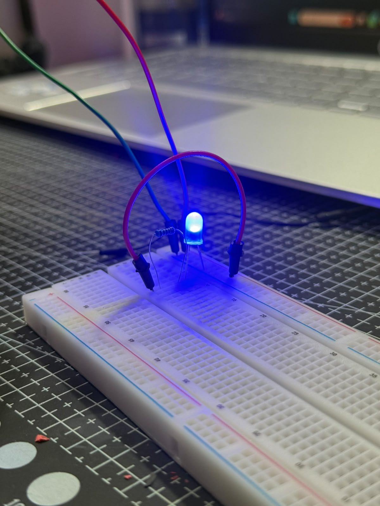
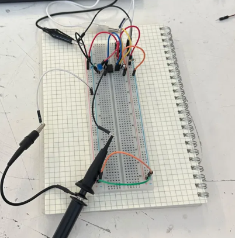

# Sesión 2 — conceptos básicos de electrónica
## Qué debía lograr hoy
- [✅] Prender un led 
- [✅] Hacer parpadear un led 

## Qué use 
- CI Temporizador 555
- Capacitor electrolítico de 33 μF
- Capacitor electrolitico de 10 μF
- Capacitor cerámico de 10 nF
- Resistencia 1KΩ
- Resistencia 15KΩ
- Resistencia 220 Ω
- Led azul 
- Cables de puente 
- Protoboard 
- Osciloscopio 
- sondas de osciloscopio

## Qué hice y qué pasó (evidencia)

*Prueba de encendido de un LED conectado en serie con una resistencia sobre protoboard.*

*Circuito con LED parpadeante, monitoreado con osciloscopio para observar la forma de la señal eléctrica.*

*Observación de la señal eléctrica del circuito mediante el osciloscopio, donde se registró su frecuencia y periodo.*

| Magnitud | Capacitor electrolítico | Capacitor cerámico |
| --- | --- | --- |
| Frecuencia | 27.78 Hz | 39.33 Hz |
| Periodo | 36.00 ms | 39.00 ms |
| Voltaje pico a pico | 5.00 V | 5.00 V |

*El capacitor cerámico tiene una capacitancia nominal mucho menor que el electrolítico, por lo que se carga y descarga más rápido a través de la resistencia del circuito. Esto reduce el tiempo que el circuito tarda en cambiar de estado, lo que se traduce en una frecuencia de oscilación más alta y un periodo más corto en comparación con el capacitor electrolítico.*

## Qué falló y cómo lo resolví

- **Síntoma:** Al intentar que el LED parpadeara automáticamente, el circuito no respondía como se esperaba. Al manipular la protoboard, se detectó que uno de los jumpers actuaba como un botón improvisado: al hacer contacto manual con él, el LED encendía y apagaba, lo que indicaba una conexión intermitente en lugar de un parpadeo generado por el circuito.

- **Cómo lo detecté:** Se movió la protoboard para aislar la causa de la falla. Al tocar uno de los jumpers, se observó que el LED cambiaba de estado, evidenciando un contacto flotante (mala conexión) en ese punto del circuito.

- **Solución:** Se probó desconectar cables de forma individual para aislar el punto de falla, sin lograr identificarlo con certeza. Ante la falta de una solución clara, se optó por desarmar completamente el circuito y volver a montarlo desde cero, verificando cada conexión. 

## Qué aprendí
Antes pensaba que un LED parpadeante necesitaba código o un microcontrolador, pero aprendí que con solo una resistencia y un capacitor bien combinados se puede lograr ese efecto de forma completamente analógica. También entendí que el valor del capacitor cambia directamente la velocidad del parpadeo, algo que no esperaba hasta verlo con mis propios ojos en el osciloscopio. Aprendí a usar la protoboard de forma más consciente, entendiendo por qué un cable mal puesto puede simular un botón y arruinar todo el circuito. Y por primera vez entendí para qué sirve realmente un osciloscopio: no solo para "ver electricidad", sino para medir con precisión frecuencia, periodo y voltaje, y así comprobar si el circuito hace lo que debería.
## Siguiente paso
Probar con otros valores de resistencia y capacitor para ver cómo cambia la velocidad del parpadeo.*