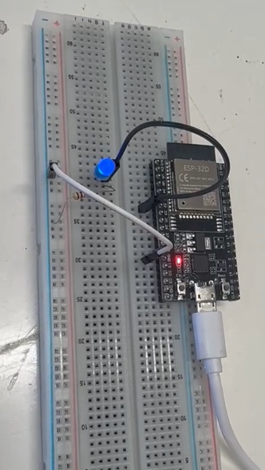
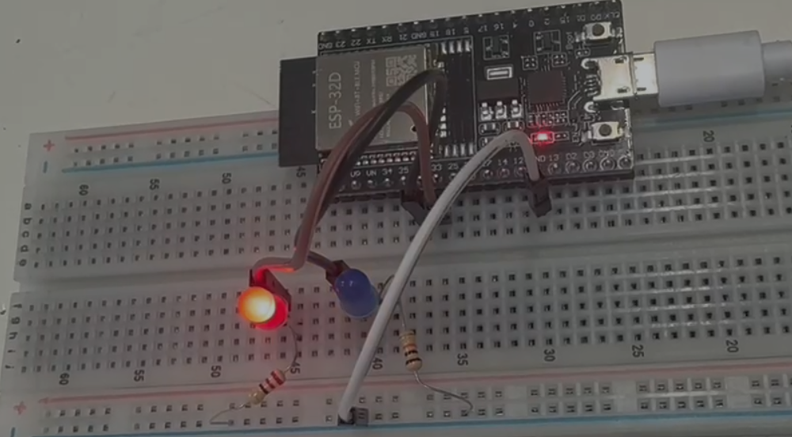

# Sesión 3 — ESP32: control de LEDs
## Qué debía lograr hoy
- [✅] Encender un LED con el ESP32
- [✅] Encender dos LEDs al mismo tiempo con el ESP32
- [✅] Hacer que dos LEDs parpadeen a destiempo con el ESP32
- [✅] Hacer que un LED parpadee al presionar un botón con el ESP32
- [✅] Presionar el botón para que, con ayuda del ESP32, la computadora reciba una señal
- [✅] Conectar el ESP32 al teléfono para enviar una señal al presionar el botón
- [✅] Conectar el teléfono al ESP32 para encender o apagar el LED
## Qué usé
- ESP32 
- Protoboard
- 2 LEDs azules
- 2 resistencias de 220
- Botón pulsador
- Cables de puente
- Cable USB

## Qué hice y qué pasó (evidencia)


*LED encendido mediante el ESP32, conectado a través de una resistencia en la protoboard.*



*Dos LEDs (rojo y azul) parpadeando a destiempo, cada uno controlado de forma independiente con el ESP32.*


*Al presionar el botón se enciende un LED y, al soltarlo, se enciende el otro, usando el ESP32 para leer el estado del botón.*

```CPP
void setup() {
  Serial.begin(9600);
  pinMode(34, INPUT);
}

void loop() {
  // put your main code here, to run repeatedly:
  if(digitalRead(34)==HIGH){
    Serial.println("PRECIONADO");
  }else{
    Serial.println("NO");
  }
}
```
*Al presionar el botón, el ESP32 detecta el estado del pin y envía la señal "PRECIONADO" a la computadora mediante el monitor serial.*
```CPP
#include "BluetoothSerial.h"
BluetoothSerial DameDeBaja;
void setup() {
  // put your setup code here, to run once:
  DameDeBaja.begin("Oliver dame de baja");
  DameDeBaja.setTimeout(20);
  Serial.begin(9600);
  pinMode(32,INPUT);
}

void loop() {
  // put your main code here, to run repeatedly:
  if(DameDeBaja.available()){
    String mensaje = DameDeBaja.readStringUntil('\n');
    mensaje.trim();
    if(mensaje == "ON"){
      digitalWrite(32,1);
    }
    if(mensaje == "OFF"){
      digitalWrite(32,0);
    }
  }
}
```
*Código en Arduino IDE que configura el ESP32 como dispositivo Bluetooth, permitiendo recibir comandos "ON"/"OFF" desde el celular para controlar un pin digital.* 
```CPP
void setup() {
  // put your setup code here, to run once:
  pinMode(33,OUTPUT);
  pinMode(32,OUTPUT);
  pinMode(34,INPUT);
}

void loop() {
  // put your main code here, to run repeatedly:
  if(digitalRead(34)==HIGH){
    digitalWrite(32,1);
    digitalWrite(33,0);
  }else{
    digitalWrite(33,1);
    digitalWrite(32,0);
  }
}
```
*Código en Arduino IDE donde el ESP32 lee el estado de un pin de entrada y enciende o apaga los LEDs correspondientes según la señal recibida.*

## Qué falló y cómo lo resolví
- **Síntoma:** El circuito no funcionaba como se esperaba porque en el código se confundían los pines configurados como entrada (INPUT) con los de salida (OUTPUT) del ESP32.
- **Cómo lo encontré:** Al revisar el comportamiento inesperado del LED y el botón, se verificó línea por línea el código, comparando cada `pinMode()` con la conexión física en la protoboard.
- **Solución:** Se consultó la datasheet del ESP32 para confirmar la función correcta de cada pin, se corrigió la asignación en el código y se volvió a probar el circuito para confirmar el funcionamiento correcto.

## Qué aprendí
Antes no sabía qué era un ESP32 ni para qué servía más allá de ser "una placa con pines", pero aprendí a identificar sus entradas y salidas y a interpretar su datasheet para saber qué pin usar y por qué. También entendí cómo controlar el estado de un LED desde código, algo que antes hacía por prueba y error sin entender la lógica detrás. Descubrí que el ESP32 puede comunicarse por Bluetooth con un celular, lo que me hizo ver que un microcontrolador no solo enciende y apaga cosas, sino que puede recibir órdenes externas en tiempo real. En general, entendí que leer bien la documentación del componente ahorra mucho tiempo de prueba y error.
## Siguiente paso
Explorar cómo controlar más de un LED de forma independiente vía Bluetooth desde el celular.