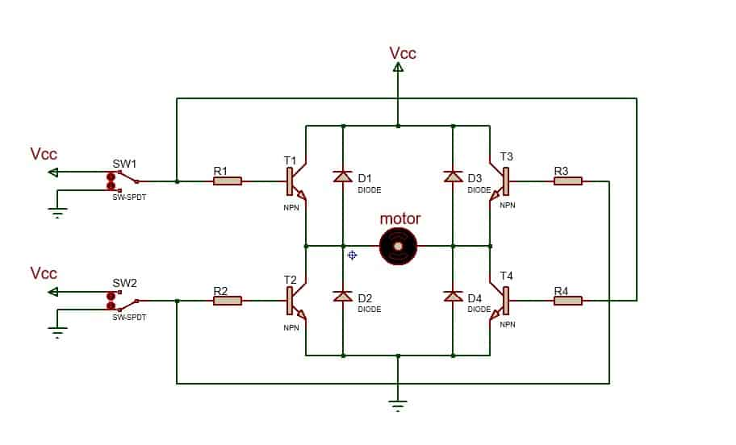

# Sesión 4 — Puente H: control de motores DC y servomotor
## Qué debía lograr hoy
- [✅] Simular el control de dos motores DC con un puente H (L293D)
- [✅] Controlar el sentido de giro de un motor DC (adelante, atrás, izquierda, derecha)
- [✅] Encender y controlar un servomotor con Arduino
## Qué usé
- Arduino UNO (simulado en Tinkercad)
- Módulo puente H L293D (simulado en Tinkercad)
- 2 motores DC (simulados en Tinkercad)
- 1 servomotor (simulado en Tinkercad)
- Batería de 9V (simulada en Tinkercad)
- Cables de conexión (simulados en Tinkercad)

## Qué hice y qué pasó (evidencia)

*Diagrama de un puente H con cuatro transistores (Q1-Q4), usado para controlar el sentido de giro de un motor DC.*

*Montaje inicial con un transistor, resistencia y LED como punto de partida antes de armar el puente H completo.*

*Simulación en Tinkercad de un Arduino UNO controlando dos motores DC a través de un módulo puente H (L293D).*

*Código en Arduino que controla dos motores DC mediante el puente H (adelante, atrás, derecha, izquierda) junto con el movimiento de un servomotor.*

## Qué falló y cómo lo resolví
- **Síntoma:** En esta práctica no falló nada, pero sorprendió lo sencillo que resulta controlar la dirección de un motor DC combinando señales HIGH/LOW en el puente H.
- **Cómo lo encontré:** También sorprendió lo versátiles que son este tipo de motores, ya que con muy pocas líneas de código se logran distintos movimientos (adelante, atrás, giros) sin necesidad de un control complejo.
- **Solución:** No fue necesaria una solución, porque en esta práctica no falló nada.

## Qué aprendí
Antes no sabía qué era un motor DC ni cómo funcionaba. Aprendí que su sentido de giro depende de la polaridad con la que se alimenta, y que por eso el puente H invierte las terminales para hacerlo girar hacia adelante o hacia atrás. También entendí que la velocidad del motor está relacionada con el voltaje aplicado: a mayor voltaje, mayor velocidad de giro. En general, comprendí que son motores simples de controlar pero muy versátiles para distintos tipos de movimiento.
## Siguiente paso
Combinar el control de los motores DC con el servomotor para lograr un movimiento coordinado.